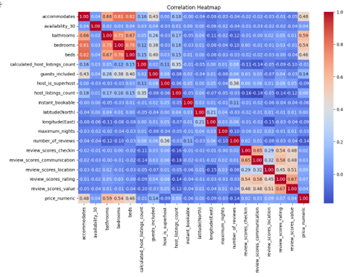
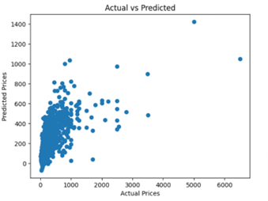
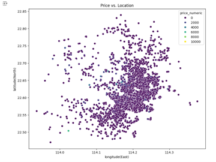
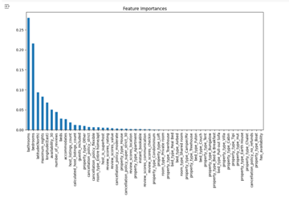

# OYO Rental Price Prediction in China

## Abstract
The hospitality industry in China is experiencing fast growth, driven by increasing domestic and international travel. Precisely predicting rental prices is important for optimizing revenue, improving customer satisfaction, and maintaining competitiveness. This machine learning BIA group 5 research explores the "OYO Rental Price Prediction in China" dataset to explore the application of machine learning techniques in solving real-world pricing challenges. This research involves data preprocessing, statistical analysis, and the development of predictive models to uncover key factors influencing rental prices. By testing and comparing the performance of at least 5 machine learning algorithms, the study aims to identify the most effective method for rental price prediction. The findings offer valuable insights for data-driven decision-making in the hospitality sector, emphasizing the role of machine learning in pricing strategies.

**Keywords**: OYO rental prices, Predictive modeling, Machine learning

## I. Introduction
The hospitality industry in China is booming, caused by a growing number of tourists and business travelers. China’s hospitality industry has seen significant growth, with companies like OYO expanding to over 10,000 hotels across 337 cities, showcasing the sector’s rapid evolution (Outlook Travel, n.d.).

With more competition among hotels and rental services, having a smart pricing strategy is very important to remain competitive. Hospitality services must balance pricing to attract consumers and ensure profitability. Predicting the right price is crucial for OYO’s business success in the long run.

This project explores how machine learning can tackle this challenge, focusing on rental price prediction for OYO properties in China. Using a dataset available on Kaggle, the project aims to identify the main factors influencing rental prices and build accurate predictive models. The work involves cleaning the data, selecting the most important variables, and visualizing patterns to set up the analysis for success. Several machine learning algorithms are tested and compared to determine the most effective.

## II. Data Source and Preprocessing

### A. Data Source
The data used in this project were obtained from publicly available datasets on Kaggle, specifically the OYO Rental Price Prediction in China dataset. 

1. **`rating_features` Dataset**: Provides detailed features of rental properties such as amenities, availability in the next 30 days, number of bedrooms, and bathrooms. Contains 5834 entries across 25 properties.
2. **`rental_price` Dataset**: Includes rental price information for the 5834 entries. Both datasets are in CSV format.

### B. Data Preprocessing
Several preprocessing steps were performed to ensure clean and usable data:

1. **Handling Missing Values**:
   - Numerical columns: Missing values were filled using the median or mode based on distribution.
   - Price column: Transformed into a numeric format (`price_numeric`) by separating numerical values and symbols.

2. **Variable Transformation**:
   - Boolean variables (`has_availability`, `host_is_superhost`, `instant_bookable`) were converted to binary (0, 1).
   - Categorical variables (e.g., `property_type`, `bed_type`, `room_type`) were one-hot encoded.

3. **Data Merging**:
   - Combined the datasets to form a comprehensive table of customer ratings, property attributes, price, and derived features.

### C. Correlation Analysis
A heatmap was generated to explore relationships between features and the dependent variable (`price_numeric`).
- Positive correlations: Features like `review_scores_value`, `bedrooms`, `bathrooms`, and `accommodates`.
- Negative correlation: `calculated_host_listings_count` indicates that hosts with more listings tend to set lower prices.

## III. Feature Selection
Feature selection was performed using:
- Correlation analysis
- Variance thresholding
- Feature importance metrics (e.g., RandomForestRegressor `feature_importances_` attribute).

### Results:
- **High-importance features**: `bathrooms`, `bedrooms`, and `latitude`.
- **Low-importance features**: Rare property types (e.g., `property_type_Hut`, `property_type_Boat`).
- **Categorical features**: Moderate importance for `property_type` and `room_type`.

## IV. Models and Methodology

### A. Models Tested
1. **Linear Regression**: Baseline model to establish foundational expectations.
2. **Random Forest**: Captures complex relationships and addresses overfitting.
3. **Gradient Boosting**: Iteratively reduces prediction errors.
4. **Support Vector Regression (SVR)**: Handles non-linear relationships.
5. **K-Means Clustering**: Used for exploratory analysis to identify natural groupings.

### B. Model Performance
| Model               | R²    | MAE     | MSE          |
|---------------------|--------|---------|--------------|
| Linear Regression   | 0.4263 | 161.913 | 101930.794   |
| Random Forest       | 0.5290 | 125.568 | 83670.358    |
| Gradient Boosting   | 0.5216 | 127.358 | 84989.940    |
| SVR                 | 0.3171 | 144.022 | 121317.891   |

### C. Observations
- **Best Performing Model**: Random Forest with the highest R² (0.5290) and lowest errors.
- **Baseline Performance**: Linear Regression yielded lower accuracy with an R² of 0.4263.

## V. Visualizations and Analysis

### A. Correlation Heatmap
Highlights relationships between features and the target variable (`price_numeric`).

### B. Scatter Plots
1. **Actual vs. Predicted Prices**: Shows moderate correlation with variability in higher price predictions.

   

2. **Location vs. Price**: Indicates clustering in central regions with high-price listings.

   

### C. Feature Importance Bar Chart
Identifies influential features like `bathrooms`, `bedrooms`, and `latitude`.

